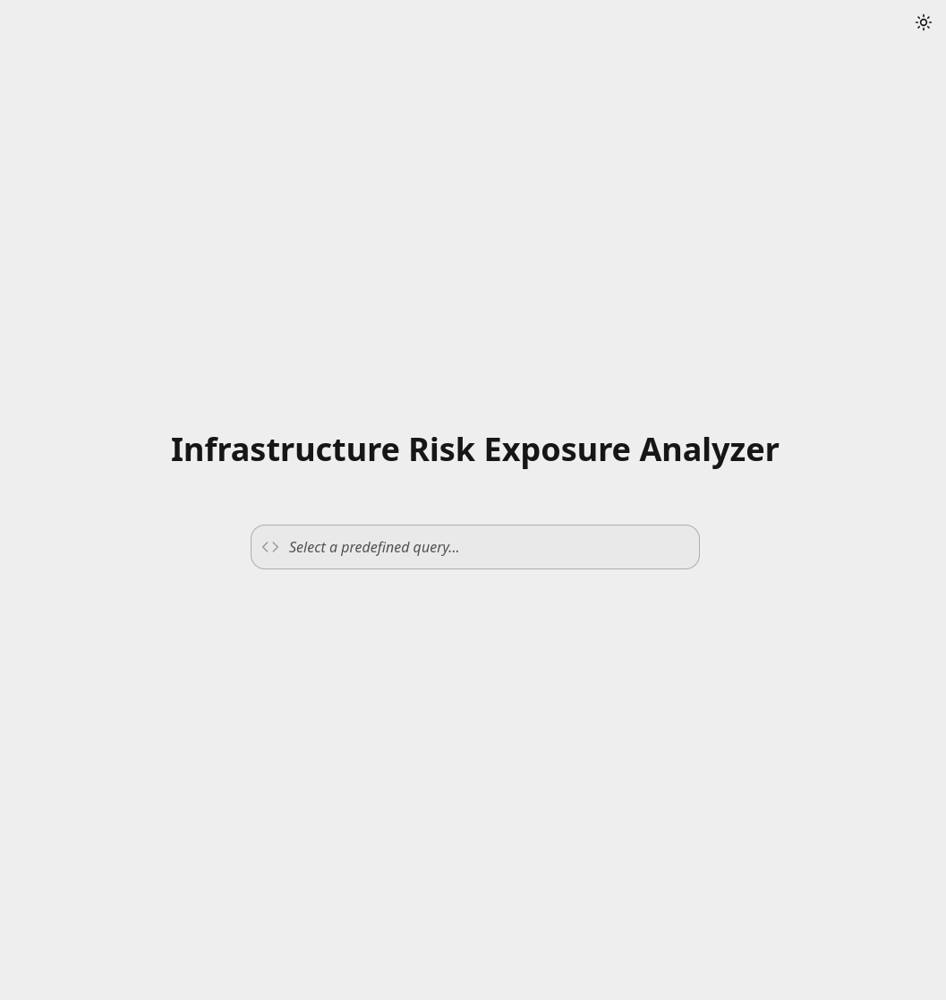
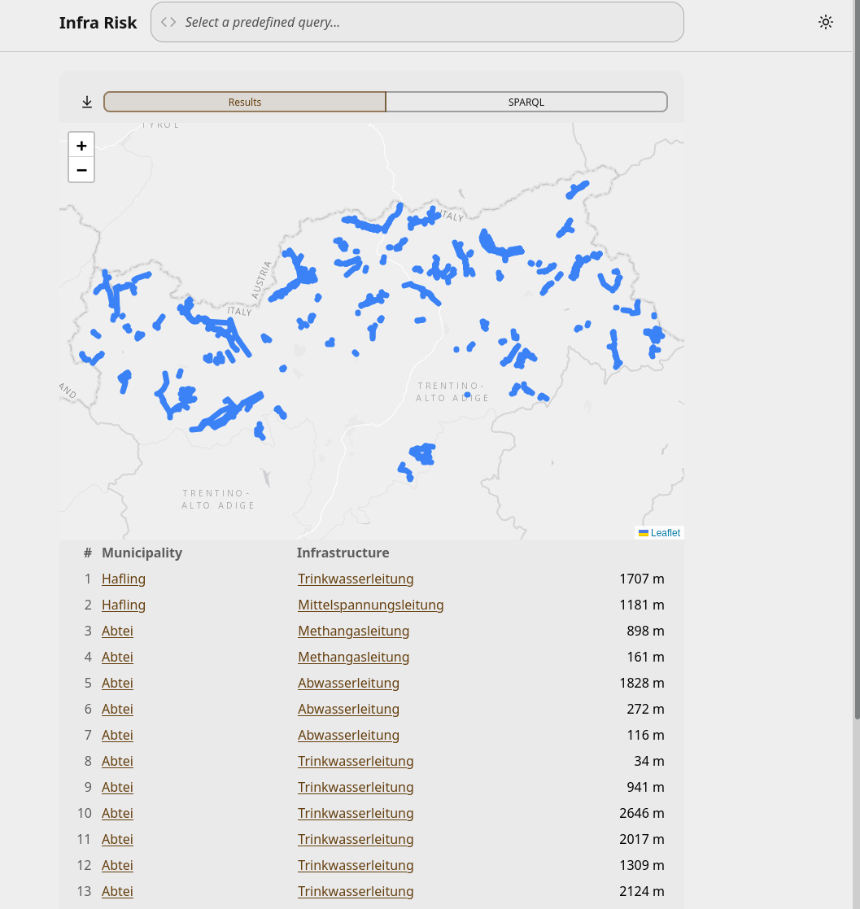
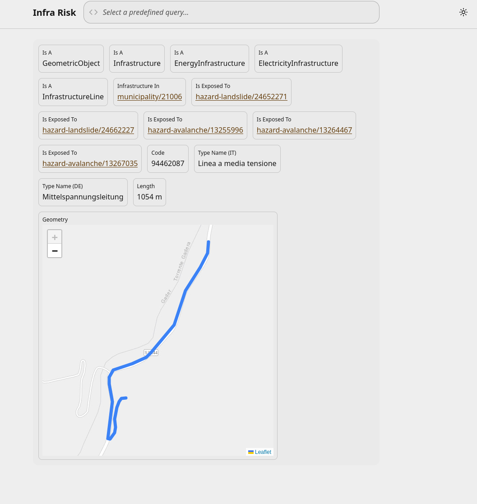

Semantic Integration of Geospatial Data for
Infrastructure Vulnerability Assessment
=======================================

## Key Project Deliverables

For evaluation purposes, the most important files are:

* **Project Report:** [`report/main.pdf`](report/main.pdf) - The comprehensive self-contained project report.
* **Final Presentation Slides:** [`presentation/main.pdf`](presentation/main.pdf) - The slides for the final project presentation.
* **Data:** `data/` - contains the raw datasets used as sources in the project.
* **Source Code:** `code/` - Contains all the source code developed for this project.
  * `code/ontology` - contains the `.owl`, `.obda`, and `.properties` files that make up the Ontop VKG specification of the project.
  * `code/sql/00.schema.sql` - Contains the SQL export of the relational database schema.
  * `code/sql/0*.*.sql` - Contain the dump of the SQL database mapped to the ontology.
  * `code/sparql` - Contains a number of SPARQL queries that have been used for testing. Each starts with a comment describing the use case.
  * `code/app` - Contains the source code of the application that was developed for the project.
  * `code/scripts` - Contains a mixture of scripts, mainly for data profiling and data loading.

A version of the developed application is hosted at http://dc.rolandb.com/, but note that since it is hosted by me from home, it may be somewhat slower and not have 100% uptime.

## Project Overview

This project focuses on assessing the exposure of critical infrastructure to natural hazards, specifically landslides and avalanches, within the Bolzano region using spatial and administrative datasets derived from the CRIMA project. The primary goal of this project is to implement a unified system leveraging Virtual Knowledge Graphs to interactively analyze and identify vulnerable infrastructure assets across specific municipalities. The project demonstrates the application of extensive data profiling using the Metanome platform and YData Profiling library to extract metadata, which directly guides the design of a relational schema deployed in a PostGIS database. In addition, the project explores semantic data integration by introducing an OWL 2 QL ontology and Virtual Knowledge Graph mappings designed via the Ontop plugin for Protégé. Finally, the project implements a custom React-based single-page web application that queries an Ontop SPARQL endpoint to support evidence-based risk assessment.

For comprehensive details on the data profiling, database schema, and mapping methodology, please refer to the report in [`report/main.pdf`](report/main.pdf).

### Features

* Comprehensive data profiling including single column, unique column combination, functional dependency, and inclusion dependency analysis using Metanome and YData Profiling.
* Design and deployment of a normalized relational schema within a spatial PostGIS database.
* Development of a domain-specific OWL 2 QL ontology modeling spatial entities, infrastructure assets, hazard areas, and administrative boundaries.
* Implementation of Virtual Knowledge Graph mappings using the Ontop plugin for Protégé.
* Dynamic computation of topological intersections between infrastructure elements and hazard zones using spatial PostGIS functions.
* Custom React-based single-page web application featuring interactive maps and dynamically updating results tables.
* Direct integration with an Ontop SPARQL endpoint to answer complex spatial queries regarding infrastructure exposure and municipal vulnerability.
* A structured project report documenting the methodology, relational schema, semantic mappings, and final results.   

### Project Structure

The project is organized into the following directories and key files:

```
├── code/
│   ├── app/                # Contains the source code for the application.
│   ├── ontology/           # Contains the ontology definitions and mappings saved by the Ontop plugin for Protege.
│   ├── sparql/             # Some SPARQL queries that have been used for testing.
│   ├── scripts/            # Contains a number of scraped used, primarily for data profiling and loading.
│   ├── sql/                # The relational schema as SQL, as well as a. SQL dump of the database.
│   ├── docker-compose.yml  # A docker compose configuration to run the application, including database and Ontop endpoint.
│   └── requirements.txt    # List of required Python dependencies to run the data profiling and loading scripts.
├── data/                   # The raw datasets that serve as the data sources in this project.
├── proposal/               # The project proposal (LaTeX).
├── presentation/           # Final project presentation slides (LaTeX).
├── report/                 # Full project report (LaTeX).
└── README.md               # This file.
```

## Setup, Installation, Usage

Before starting, you should download the repository locally by running the following commands:

```bash
git clone https://github.com/rolandbernard/dc-projects
cd dc-projects/project
```

You can run this project either outside Docker, or by using the provided Docker Compose configuration file. Using the Docker Compose configuration is most likely going to be easier, but less suitable for development.

*Note: The project has only been tested on Linux running on x86-64 hardware.*

## Using Docker Compose

Assuming you have Docker and Docker Compose installed on your machine, getting this project up and running should be as easy as running `docker compose up` in the `code/` directory of this project. The Docker Compose file contains a service for the PostGIS database, the Ontop endpoint as well as an HTTP server to serve the web application. The dataset is automatically loaded into the PostgreSQL database when initializing the container. Subsequently the web server that will be available at `http://localhost:8888`.

The default settings will get you up and running, but if you want to change some configuration parameters copy the `.env.example` file to `.env` and change the defined variables as you see fit.

To understand how to run the system outside docker compose, please consult the `code/docker-compose.yml` and `code/app/Dockerfile` files.

## Screenshots of the User Interface

### Home Page


### Query Result Page


### Infrastructure Entity Page

